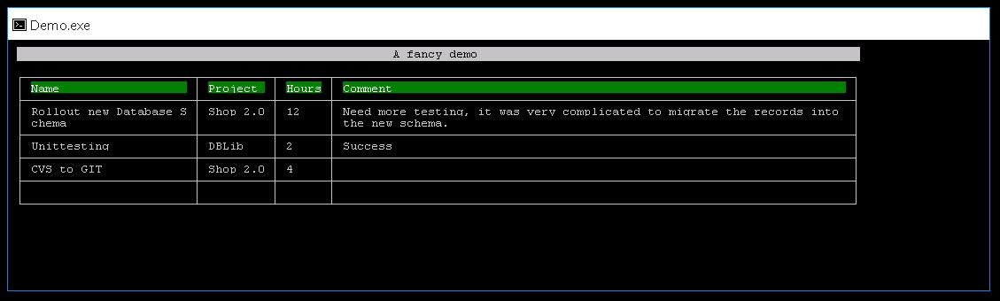

This extension for [PerrysNetConsole](https://github.com/perryflynn/PerrysNetConsole)
generates from the console application output a fancy HTML file.

```cs
using (var writer = new CoExHtmlWriter() { Title = "A fancy demo" })
{
    CoEx.WriteTitleLarge("A fancy demo");
    CoEx.WriteLine();
    CoEx.WriteTable(tabledata);

    writer.SaveAs(target);
}
```

## Demo

